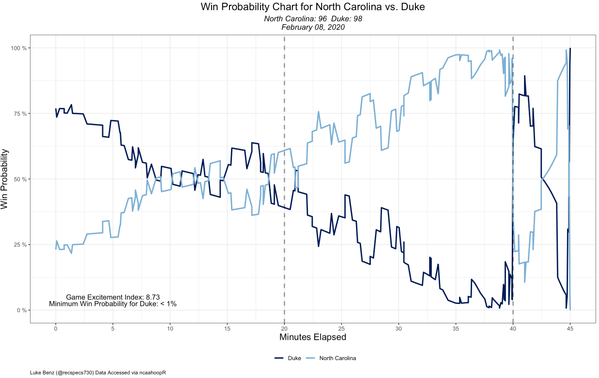

# ncaahoopR 
`ncaahoopR` is an R package for working with NCAA Basketball Play-by-Play Data. It scrapes play-by-play data and returns it to the user in a tidy format, allowing the user to explore the data with assist networks, shot charts, and in-game win-probability charts.

For pre-scraped schedules, rosters, box scores, and play-by-play data, check out the [ncaahoopR_data repository](https://github.com/lbenz730/ncaahoopR_data).

To see the lastest changes in version 1.5, view the change log [here](https://lukebenz.com/post/ncaahoopr_v1.5/).

## Installation
You can install `ncaahoopR` from GitHub with:

``` r
# install.packages("devtools")
devtools::install_github("lbenz730/ncaahoopR")
```

If you encounter installation issues, the following tips have helped a few users successfully install the package:

* If given the option to compile any packages from source rather than installing existing binaries, choose `'No'`.
* Windows users with trouble installing the package should try running the following command before reinstalling the package: `Sys.setenv(R_REMOTES_NO_ERRORS_FROM_WARNINGS = "true")`
* Windows users with touble installing `devtools` should try first installing the `backports` package via `install.packages("backports")`.


## Functions
Several functions use ESPN game_ids. You can find the game_id in the URL for the game summary, 
as shown in the URL for the summary of the UMBC-Virginia game below.


### Scraping Data
* ```get_pbp(team, season)```: Get entire current season's worth of play-by-play data for a given team and season. `season` defaults to current season, but can be specified in "2019-20" form. 
* ```get_pbp_game(game_ids, extra_parse)```:  Get play-by-play data for a specific vector of ESPN game_ids. `extra_parse` is a logical whether to link shot variables and attempt possesion parsing. Default =   `TRUE`.
* ```get_roster(team, season)```: Get a particular team's roster. `season` defaults to current season, but can be specified in "2019-20" form. 
* ```get_schedule(team, season)```: Get a team's schedule. `season` defaults to current season, but can be specified in "2019-20" form. 
* ```get_game_ids(team, season)```: Get a vector of ESPN game_ids for all games involving ```team``` specified. `season` defaults to current season, but can be specified in "2019-20" form.
* ```get_master_schedule(date)```: Get schedule of all games for given date. Use `YYYY-MM-DD` date formatting.
* `get_boxscore(game_id)`: Returns list of 2 data frames, one with each teams' box score for the game in question. Written by [Jared Andrews](https://github.com/j-andrews7).

* `season_boxscore(team, season = current_season, aggregate = 'average')`: Returns (aggregated) player stats over the course of a season for a given team.
        * `team`: team to return player stats for.
        * `season`: of form YYYY-YY. Defaults to current season.
        * `aggregate`: one of 'average' (per-game average statistics), 'total' (sums of season stats) or 'raw' (just return all box scores binded together). 'average' is the default. Contributed in collaboration with [Kurt Wirth](https://github.com/kurtawirth)

The `team` parameter in the above functions must be a valid team name from the `ids` dataset built into the package. See the __Datasets__ section below for more details.

### Win-Probability and Game-Flow Charts

__Win Probability Charts__

A prior version of `wp_chart` used base R while `gg_wp_chart` used the `ggplot2` plotting library. As of the 2020-21 season, both functions call the same `ggplot2` library, and `gg_wp_chart` now simply aliases `wp_chart`

```wp_chart(game_id, home_col, away_col, show_legend = T)```

* ```game_id``` ESPN game_id for the desired contest.
* ```home_col``` Chart color for home team.
* ```away_col```: Chart color for away team.
* `include_spread`: Logical, whether to include pre-game spread in Win Probability calculations. Default = `TRUE`.
* ```show_legend```: Logical, whether or not to show legend/text on chart. Default = `TRUE`.


```gg_wp_chart(game_id, home_col, away_col, show_labels = T)```

* ```game_id``` ESPN game_id for the desired contest.
* ```home_col``` Chart color for home team.
* ```away_col```: Chart color for away team.
* `include_spread`: Logical, whether to include pre-game spread in Win Probability calculations. Default = `TRUE`.
* `show_labels`: Logical whether Game Excitement Index and Minimum Win Probability metrics should be displayed on the plot. Default = `TRUE`.

__Game Flow Charts__

```game_flow(game_id, home_col, away_col)```

* ```game_id``` ESPN game_id for the desired contest.
* ```home_col``` Chart color for home team.
* ```away_col``` Chart color for away team.

__Game Excitement Index__

```game_exciment_index(game_id, include_spread = T)```

* `include_spread`: Logical, whether to include pre-game spread in Win Probability calculations. Default = `TRUE`.

Returns ```GEI``` (Game Excitement Index) for given ESPN game_id. For more information about how these win-probability charts are fit and how Game Excitement Index is calculated, check out the below links


* [Model Methodology](https://lukebenz.com/post/ncaahoopr_win_prob/)
* [Game Excitement Index](https://lukebenz.com/post/gei/)

__Game Control Measures__

```average_win_prob(game_id, include_spread = T)```

* ESPN game_id for which to compute time-based average win probability (from perspective of home team).
* `include_spread`: Logical, whether to include pre-game spread in Win Probability calculations. Default = `TRUE`.

```average_score_diff(game_id)```

* ESPN game_id for which to compute time-based average score differential (from perspective of home team).


### Assist Networks

__Traditional Assist Networks__

```assist_net(team, season, node_col, three_weights = T, threshold = T, message = NA, return_stats = T)```

* ```team``` is the ESPN team name, as listed in the `ids` data frame.
* ```season``` Options include "2018-19" (for entire season), or a vector of ESPN game IDs. 
* ```node_col``` is the node color for the graph.
* ```three_weights``` (default = ```TRUE```): Logical. If TRUE, assisted three-point shots are given a weight of 1.5. If FALSE, assisted three-point shots are given a weight of 1. In both cases, assisted two-point shots are given a weight of 1. 
* `threshold` (default = 0) Number between 0-1 indicating minimum percentage of team's assisted baskets a player needs to be involved in to be included in network graph.
* ```message``` (default = ```NA```) Option for custom message to replace graph title when using a subset of the season (e.g. conference play).
* `return_stats` (default = `TRUE`) Return Assist Network-related statistics

__Circle Assist Networks and Player Highlighting__

```circle_assist_net(team, season, highlight_player = NA, highlight_color = NA, three_weights = T, threshold = 0, message = NA, return_stats = T)```

* ```team``` is the ESPN team name, as listed in the `ids` data frame.
* ```season```: Options include "YYYY-YY" (for entire season), or a vector of ESPN game IDs. 
* ```highlight_player``` (default = `NA`) Name of player to highlight in assist network. `NA` yields full-team assist network with no player highlighting.
* ```highlight_color``` (default = `NA`) Color of player links to be highlighted. `NA` if ```highlight_player``` is `NA`.
* ```three_weights``` (default = ```TRUE```): Logical. If TRUE, assisted three-point shots are given a weight of 1.5. If FALSE, assisted three-point shots are given a weight of 1. In both cases, assisted two-point shots are given a weight of 1.  
* `threshold` (default = 0) Number between 0-1 indicating minimum percentage of team's assisted baskets a player needs to be involved in to be included in network graph.
* `message` (default = `NA`) User-supplied plot title to overwrite default plot title, if desired.
* `return_stats` (default = `TRUE`) Return Assist Network-related statistics

### Shot Charts
There are currently three functions for scraping and plotting shot location data. These functions are written by [Meyappan Subbaiah](https://github.com/meysubb).

`get_shot_locs(game_id)`: Returns data frame with shot location data when available. Note that if the `extra_parse` flag in `get_pbp_game` is set to `TRUE`, shot location data will already be included in the play-by-play data (if available).

* `game_id`: ESPN game_id from which shot locations should be scraped.

`game_shot_chart(game_id, heatmap = F)`: Plots shots for a given game.

* `game_id`: ESPN game_id from which shot locations should be scraped.
* `heatmap` (default = `FALSE`): Logical, whether to use density-heat map or plot individual points.
* shot-plotting colors derived from team's primary color listed in `ncaa_colors` data frame.

`team_shot_chart(game_ids, team, heatmap = F)`: Plots shots taken by team during a given set of game(s).

* `game_ids`: Vector of ESPN game_ids from which shot locations should be scraped.
* `team`: Which team to chart shots for.
* `heatmap` (default = `FALSE`): Logical, whether to use density-heat map or plot individual points.
* shot-plotting colors derived from team's primary color listed in `ncaa_colors` data frame.

`opp_shot_chart(game_ids, team, heatmap = F)`: Plots shots against a team during a given set of game(s).

* `game_ids`: Vector of ESPN game_ids from which shot locations should be scraped.
* `team`: Which team to chart opponents' shots for.
* `heatmap` (default = `FALSE`): Logical, whether to use density-heat map or plot individual points.


## Datasets

```dict``` A data frame for converting between team names from various sites.
 
 * ```NCAA```: the name of the team, as listed on the NCAA website
 * ```ESPN```: the name of the team, as listed in ESPN URLs
 * ```ESPN_PBP```: the name of the team, as listed in the ESPN Play-By-Play logs
 * ```Warren_Nolan```: the name of the team, as listed on WarrenNolan.com
 * ```Trank```: the name of the team, as listed on barttorvik.com
 * ```name_247```: the name of the team, as listed on 247Sports.com

```ids``` A data frame for converting between team names from various sites.
 
 * ```team```: the name of the team to be supplied to functions in ncaahoopR package
 * ```id```: team id; used in ESPN URLs
 * ```link```: link; used in ESPN URLs
 
 
 ```ncaa_colors``` A data frame of team color hex codes, pulled from [teamcolorcodes.com](https://teamcolorcodes.com/). Additional data coverage provided by [Luke Morris](https://lukesmorris.com).
 

* `ncaa_name`: The name of the team, as listed on the NCAA website (same as `dict$NCAA`)
* `espn_name`: The name of the team, as listed in ESPN URLs (same as dict$ESPN)}
* `primary_color`: Hexcode for team's primary color.
* `secondary_color`: Hexcode for team's secondary color, when available.
* `tertiary_color`: Hexcode for team's tertiary color, when available.
* `color_4`: Hexcode for team's 4th color, when available.
* `color_5`: Hexcode for team's 5th color, when available.
* `color_6`: Hexcode for team's 6th color, when available.


_Primary and secondary colors for all 353 teams._


These datasets can be loaded by typing ```data("ids")```, `data("ncaa_colors")`, or ```data("dict")```, respectively.

## Examples
#### Win Probability Charts


```wp_chart(game_id = 401082978, home_col = "gray", away_col = "orange")```


```wp_chart(game_id = 401168364, home_col = "#7BAFD4", away_col = "#001A57")```

#### Game Flow Chart

```game_flow(game_id = 401082669, home_col = "blue", away_col = "navy")```

#### Single-Game Assist Network

```assist_net(team = "Oklahoma", node_col = "firebrick4", season = 400989185)```

#### Season-Long Assist Network

```assist_net(team = "Yale", node_col = "royalblue4", season = "2017-18")```


#### Circle Assist Networks

```circle_assist_net(team = "UNC", season = 401082861)```

#### Player Highlighting

```circle_assist_net(team = "San Francisco", season = "2018-19", highlight_player = "Frankie Ferrari", highlight_color = "#FDBB30")```

#### Shot Charts

```game_shot_chart(game_id = 401168364, heatmap = T)```


`game_shot_chart(game_id = 401168364)`

## Glossary
Play-by-Play files contain the following variables:

* ```game_id```: ESPN game_id for the game in question.
* ```date```: Date of game.
* ```home```: Name of the home team.
* ```away```: Name of the away team.
* ```play_id```: Unique identifier of play/event in sequence of game events.
* ```half```: Period of action in the game. 1 and 2 denote the first and second halves of play, while 3 denotes OT1, 4 denotes OT2 etc.
* ```time_remaining_half```: Time remaining in the period as it would appear on a scoreboard.
* ```secs_remaining```: Time remaining in regulation, in seconds.
* ```secs_remaining_absolute```: The time remaining until the game is over, in seconds. For example a game that goes to overtime would begin with 2700 seconds remaining (2400 for regulation and 300 for overtime), and regulation would end with 300 seconds remaining.
* ```description```: A description of the play/game event.
* ```home_score```: Home team's score.
* ```away_score```: Away team's score.
* ```score_diff```: Score differential from the home team's perspective (```home_score``` - ```away_score```)
* ```play_length```: Duration of the the given play, in seconds.
* ```win_prob```: Win probability for the home team.
* ```naive_win_prob```: Win probability for the home team not factoring in pre-game point spread. Useful for computation of win probability added (WPA).
* ```home_timeout_remaining```: Number of timeouts remaining for the home team.
* ```away_timeout_remaining```: Number of timeouts remaining for the away team.
* ```home_favored_by```: Number of points by which the home team is favored, prior to tip-off. If Vegas point spread is available on ESPN, that is used as the default. When not available, an attempt is made to impute the pre-game point spread from derived team strengths. Imputed point spreads are not available for games prior to the 2016-17 season or when one of the teams is not in Division 1.
* ```total_line```: Total Vegas over/under for the game, where available.
* ```referees``` Referees for the game.
* `arena_location`: City in which the game was played.
* `arena`: Name of arena where game was played.
* `capacity`: Capacity of arena where game was played.
* `attendance`: Attendance of game, where available.
* `wrong_time`: An attempt to label play-by-play events tagged at the wrong time. These are filtered out of all graphical and statistical helper functions, but may still be useful for certain analyses where time of event is of less importance.

If `extra_parse = TRUE` in `get_pbp_game`, the following variables are also included.

* `shot_x`: The half-court x coordinate of shot. 
* `shot_y`: The half-court y coordinate of shot. (0,0) represents the bottom left corner and (50, 47) represents the top right corner (from persepective of standing under hoop).
* `shot_team`: Name of team taking shot.
* `shot_outcome`: Whether the shot was `made` or `missed`.
* `shooter`: Name of player taking shot.
* `assist`: Name of player asssisting shot (assisted shots only)
* `three_pt`: Logical, if shot is 3-point field goal attempt.
* `free_throw`: Logical, if shot is free throw attempt.

---
Stand-alone shot location data frames contain the following variables.

* `team_name`: Name of shooting team.
* `shot_text`: Description of shot.
* `color`: Color hexcode used to render shot chart graphic on ESPN.
* `date`: Date of game
* `outcome`: Whether the shot was made or missed
* `shooter`: Player attempting the shot
* `assister`: Playing assisting the shot
* `three_pt`: Logical, whether the shot is a 3-point attempt
* `x`: x-coordinate of shot location
* `y`: y-coordinate of shot location

The court is 50 feet by 94 feet, with (0,0) always being placed in the bottom left corner of the shot chart. Any full-court shot chart rendered using `game_shot_chart()` preserves ESPN shot locations as they are found online, while halfcourt charts using `team_shot_chart()` convert all shot locations to to a 50 feet by 47 feet halfcourt. The perspective on the halfcourt shot charts is as if one is standing under the hoop, looking toward the opposition hoop. (0,0) again represents the bottom left corner and (50, 47) represents the top right corner. 
