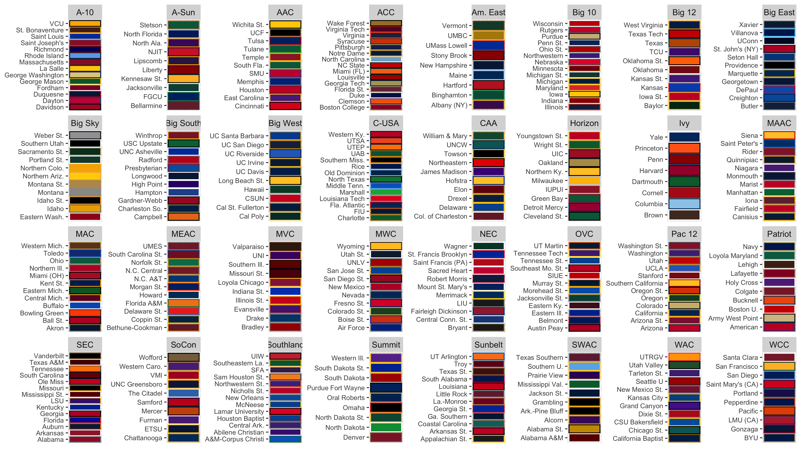
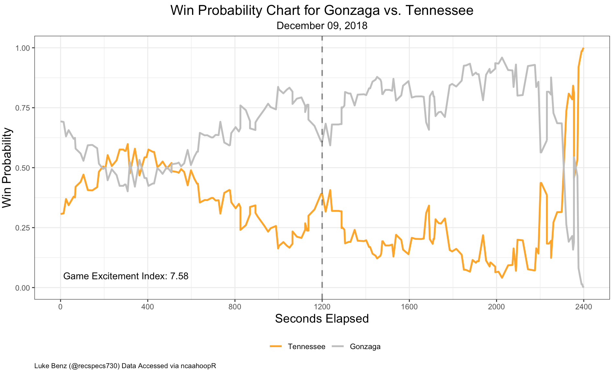
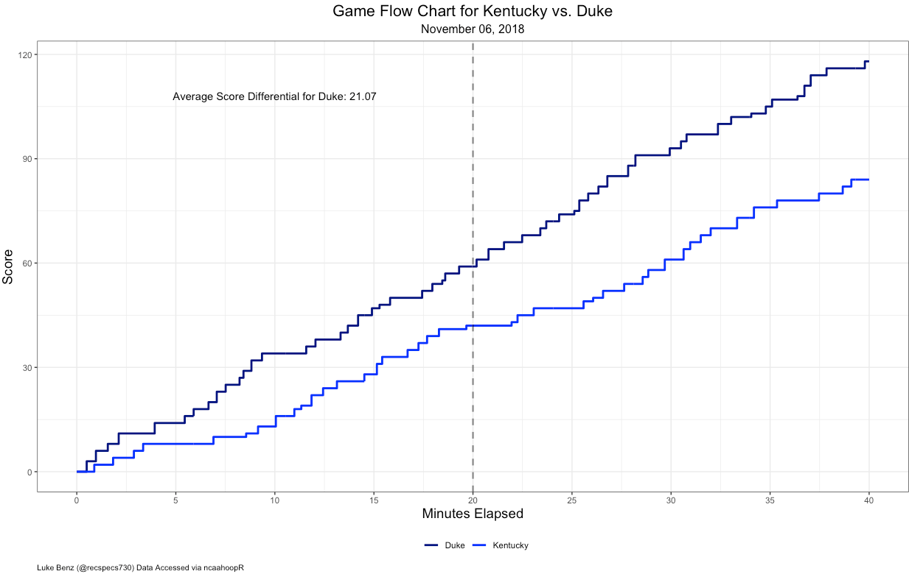
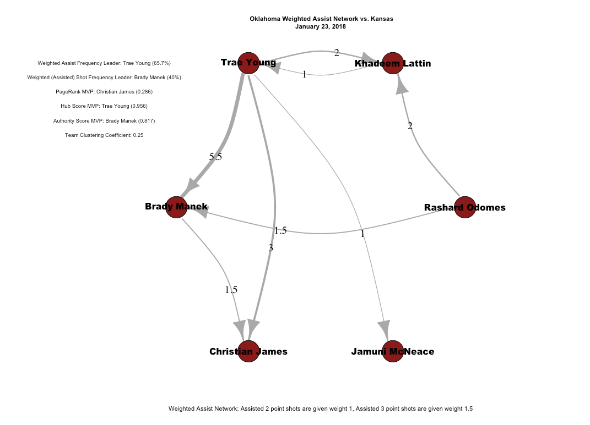
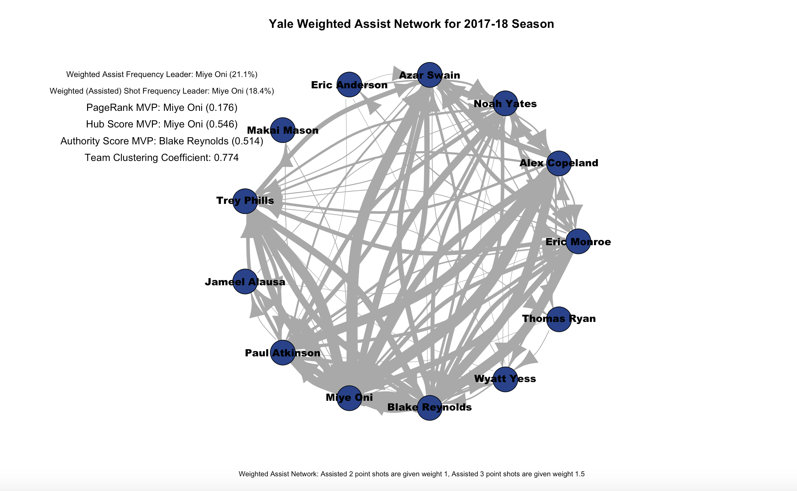
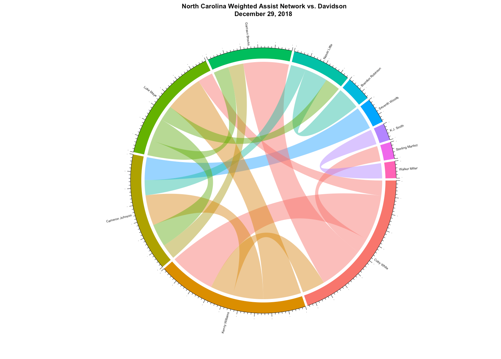
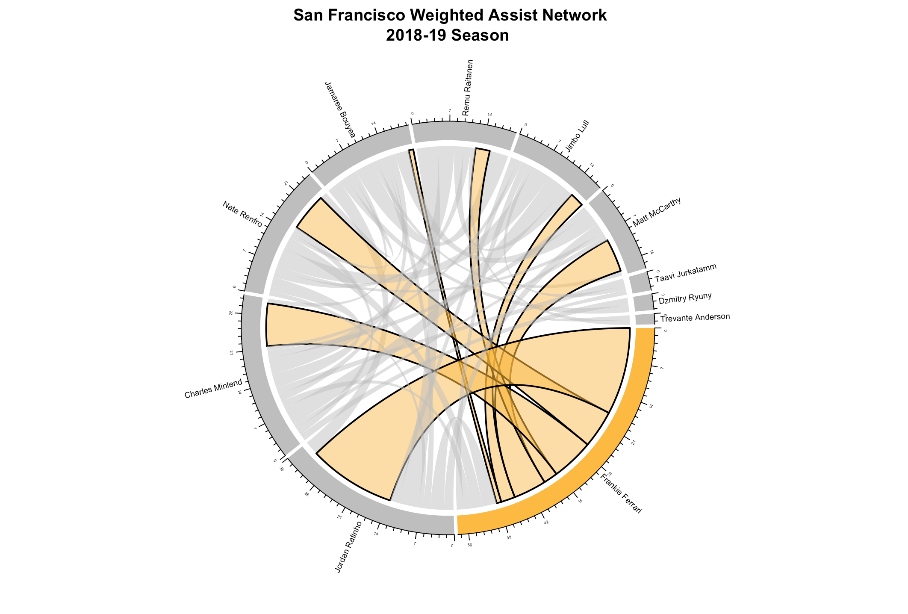
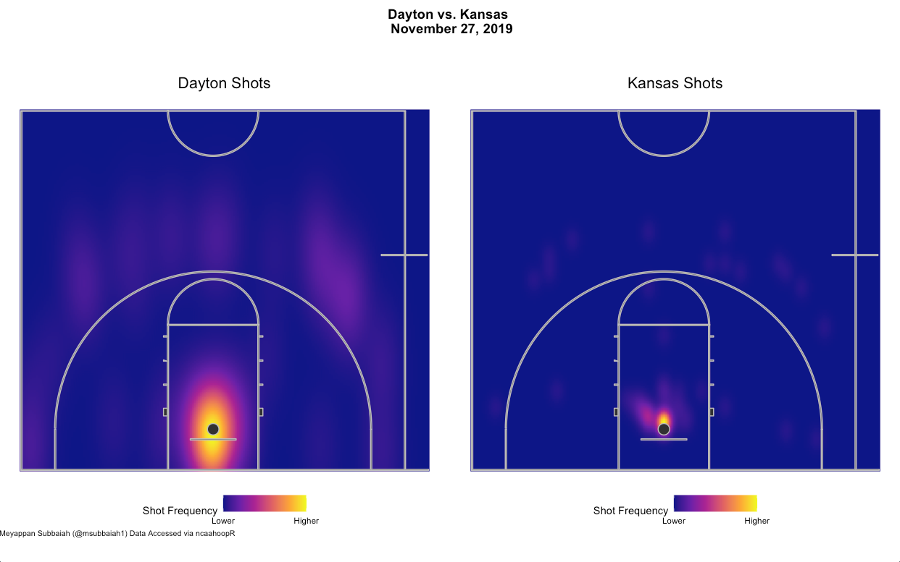
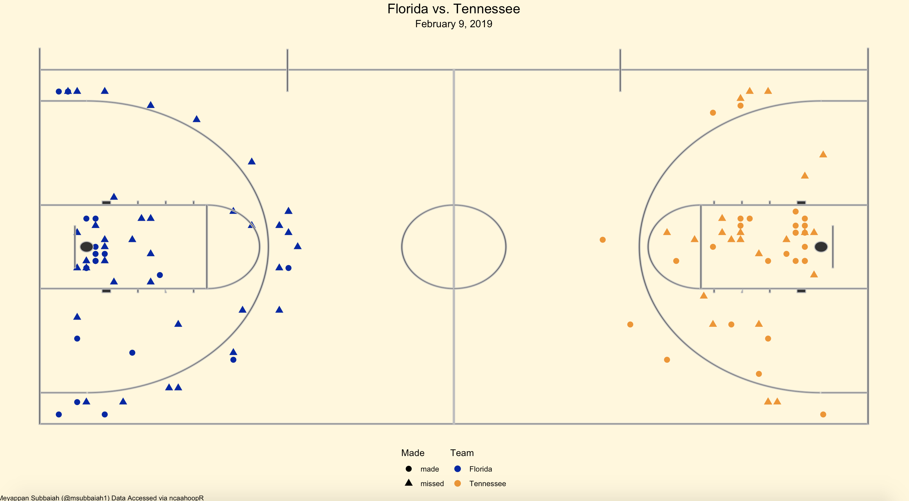

# ncaahoopR 
`ncaahoopR` is an R package for working with NCAA Basketball Play-by-Play Data. It scrapes play by play data 
and returns it to the user in a tidy format and allows the user to explore the data with assist networks and in game win-probability charts.

__Note:__ `ncaahoopR` scrapes data from ESPN. Since ESPN is currently updating many college basketball pages, such as schedules and rosters,
some functionality may be temporarily unavailable. Once we approach the beginning of the season, all functionality should work as desired.


## Installation
You can install `ncaahoopR` from GitHub with:

``` r
# install.packages("devtools")
devtools::install_github("lbenz730/ncaahoopR")
```

## Functions
Several functions use ESPN game_ids. You can find the game_id in the URL for the game summary, 
as shown in the url for the summary of the UMBC-Virginia game below.


### Scraping Data
* ```get_pbp(team)```: Game entire current season's worth of play-by-play data for a given team.
* ```get_pbp_game(game_ids)```:  Get play-by-play data for a specific vector of ESPN game_ids. 
* ```get_roster(team)```: Get a particular team's roster. 
* ```get_schedule(team)```: Get a team's schedule.
* ```get_game_ids(team)```: Get a vector of ESPN game_ids for all games in which ```team``` plays in.
* ```get_master_schedule(year, month, day)```: Get schedule of all games for given date.

The `team` parameter in the above functions must be a valid team name from the `ids` data set built into the package. See the __Datesets__ section below for more details.

### Win-Probability and Game-Flow Charts

__Win Probability Charts__

There are two functions for plotting win probability charts, one that uses base graphics (`wp_chart`), and the other which uses the ```ggplot2``` library (```gg_wp_chart```). Both are maintainted, as graphics in base R have some nice concatenation principles.

```wp_chart(game_id, home_col, away_col, show_legend = T)```

* ```game_id``` ESPN game_id for the desired win probability chart.
* ```home_col``` Chart color for home team.
* ```away_col```: Chart color for away team.
* ```show_legend```: Logical, whether or not to show legend/text on chart. Default = `TRUE`.


```gg_wp_chart(game_id, home_col, away_col, show_labels = T)```

* ```game_id``` ESPN game_id for the desired win probability chart.
* ```home_col``` Chart color for home team.
* ```away_col```: Chart color for away team.
* `show_labels`: Logical whether Game Exictement Index and Minimum Win Probability metrics should be displayed on the plot. Default = `TRUE`.

__Game Flow Charts__

```game_flow(game_id, home_col, away_col)```

* ```game_id``` ESPN game_id for the desired game flow chart.
* ```home_col``` Chart color for home team.
* ```away_col```: Chart color for away team.

__Game Excitement Index__

```game_exciment_index(game_id)```

Returns ```GEI``` (Game Excitement Index) for given ESPN game_id. For more information about how these win-probability charts are fit and how Game Excitemnet Index is calculated, check out the below links

* [Model Methodology](https://sports.sites.yale.edu/ncaa-basketball-win-probability-model)
* [Game Excitement Index](https://sports.sites.yale.edu/game-excitement-index-part-ii)

__Game Control Measures__

```average_win_prob(game_id)```

* ESPN game_id for which to compute time-based average win probability (from perspective of home team).

```average_score_diff(game_id)```

* ESPN game_id for which to compute time-based average score differential (from perspective of home team).


### Assist Networks

__Traditional Assist Networks__

```assist_net(team, season, node_col, three_weights, threshold, message = NA)```

* ```team``` is the ESPN team name, as listed in the `ids` dataframe.
* ```season```: Options include "2018-19" (for entire season), or a vector of ESPN game IDs. 
* ```node_col``` is the node color for the graph.
* ```three_weights``` (default = ```TRUE```): Logical. If TRUE, assisted three point shots are given 1.5 weight. If FALSE, assisted three point shots are given weight 1. In both cases, assisted 2 point shots are given weight 1. 
* `threshold`: Number between 0-1 indicating minimum percentage of team assists/baskets a player needs to exceed to be included in network. Default = 0.
* ```message``` (default = ```NA```) Option for custom message to replace graph title when using a subset of the season (e.g. conference play).

__Circle Assist Networks and Player Highlighting__
```circle_assist_net(team, season, highlight_player, highlight_color, three_weights, message = NA)```

* ```team``` is the ESPN team name, as listed in the `ids` dataframe.
* ```season```: Options include "2018-19" (for entire season), or a vector of ESPN game IDs. 
* ```highlight_player```: Name of player to highlight in assist network. `NA` yields full team assist etwork with no player highlighting. Default = `NA`.
* ```highlight_color```: Color of player links to be highlighted. `NA` if ```highlight_player``` is `NA`.
* ```three_weights``` (default = ```TRUE```): Logical. If TRUE, assisted three point shots are given 1.5 weight. If FALSE, assisted three point shots are given weight 1. In both cases, assisted 2 point shots are given weight 1. 
* `threshold`: Number between 0-1 indicating minimum percentage of team assists/baskets a player needs to exceed to be included in network. Default = 0.

### Shot Charts
There are currently three functions for scraping and plotting shot location data. These functions are written by [Meyappan Subbaiah](https://github.com/meysubb).

`get_shot_locs(game_id)`: Returns data frame with shot location data when avaiable.

* `game_id`: ESPN game_id for which to scrape shot location.

`game_shot_chart(game_id, heatmap = F)`: Plots shots for a given game.

* `game_id`: ESPN game_id for which to scrape shot location.
* `heatmap`: Logical, whether to use density-heatmap or plot individual points. Default = `FALSE`.

`team_shot_chart(game_id, team, heatmap = F)`: Plots shots for a given game.

* `game_id`: Vector ESPN game_id for which to scrape shot location.
* `team`: Which team to chart shots for.
* `heatmap`: Logical, whether to use density-heatmap or plot individual points. Default = `FALSE`.

## Datasets

```dict``` A dataframe for converting between team names from various sites.
 
 * ```NCAA```: the name of the team, as listed on the NCAA website
 * ```ESPN```: the name of the team, as listed on the ESPN URLs
 * ```ESPN_PBP```: the name of the team, as listed on the ESPN Play-By-Play logs
 * ```Warren_Nolan```: the name of the team, as listed on WarrenNolan.com
 * ```Trank```: the name of the team, as listed on barttorvik.com
 * ```name_247```: the name of the team, as listed on 247Sports.com

```ids``` A dataframe for converting between team names from various sites.
 
 * ```team```: the name of the team to be suplied to function in ncaahoopR package
 * ```id```: team id; used in ESPN URLs
 * ```link```: link; used in ESPN URLs
 
 
 ```ncaa_colors``` A dataframe of team color hex codes, pulled from [teamcolorcodes.com](https://teamcolorcodes.com/). Note that hexcodes are only available for 248 of 353 Division 1 teams.
 

* `ncaa_name`: The name of the team, as listed on the NCAA website (same as `dict$NCAA`)
* `espn_name`: The name of the team, as listed on the ESPN URLs (same as dict$ESPN)}
* `primary_color`: Hexcode for team's primary color.
* `secondary_color`: Hexcode for team's secondary color, when available.
* `tertiary_color`: Hexcode for team's tertiary color, when available.
* `color_4`: Hexcode for team's 4th color, when available.
* `color_5`: Hexcode for team's 5th color, when available.
* `color_6`: Hexcode for team's 6th color, when available.


_Primary and secondary colors for available teams._


These datasets can be loaded by typing ```data("ids")```, `data("ncaa_colors")`, or ```data("dict")```, respectively.

## Examples
#### Win Probability Charts

```wp_chart(game_id = 401025888, home_col = "navy", away_col = "goldenrod1")```


```gg_wp_chart(game_id = 401082978, home_col = "gray", away_col = "orange")```

#### Game Flow Chart

```game_flow(game_id = 401082669, home_col = "blue", away_col = "navy")```

#### Single Game Assist Network

```assist_net(team = "Oklahoma", node_col = "firebrick4", season = 400989185)```

#### Season Long Assist Network

```assist_net(team = "Yale", node_col = "royalblue4", season = "2017-18")```


__NOTE:__ The argument ```season = "2017-18"``` would be replaced with the current season. Backdated charts are currently not avaiable.

#### Circle Assist Networks

```circle_assist_net(team = "UNC", season = 401082861)```

#### Player Highlighting

```circle_assist_net(team = "San Francisco", season = "2018-19", highlight_player = "Frankie Ferrari", highlight_color = "#FDBB30")```

#### Shot Charts

```game_shot_chart(game_id = 401083557, heatmap = T)```


`game_shot_chart(game_id = 401083557)`

## Glossary
Play-by-Play files contain the following variables:

* ```play_id```: Unique identifier of play/event in sequence of game events.
* ```half```: Period of action in the game. 1 and 2 denote the first and second halves of play, while 3 denotes OT1, 4 denotes OT2 etc.
* ```time_remaining_half```: Time remaining in the peroid as it would appear on a scoreboard.
* ```secs_remaining```: Time remaining in regulation, in seconds.
* ```secs_remaining_absolute```: The time remaining until the game is over, in seconds. For example a game that goes to overtime would begin with 2700 seconds remaining (2400 for regulation and 300 for overtime), and regulation would end with 300 seconds remaining.
* ```description```: A description of the play/game event.
* ```home_score```: Home team's score.
* ```away_score```: Away team's score.
* ```score_diff```: Score differential from the home team's perspective (```home_score``` - ```away_score```)
* ```play_length```: Duration of the the given play, in seconds.
* ```win_prob```: Win probability for the home team.
* ```home```: Name of the home team.
* ```away```: Name of the away team.
* ```home_timeout_remaining```: Number of timeouts remaining for the home team.
* ```away_timeout_remaining```: Number of timeouts remaining for the away team.
* ```home_timeout_ind```: Binary indicator of whether home team took a timeout in the previous 60 seconds of game time.
* ```away_timeout_ind```: Binary indicator of whether away team took a timeout in the previous 60 seconds of game time.
* ```home_favored_by```: Number of points by which the home team is favored, prior to tip-off. If Vegas point spread is available on ESPN, that is used as the default. When not available, an attempt is made to impute the pre-game point sread from derived team strengths. Imputed point spreads are not available for games prior to the 2016-17 season or when one of the teams is not in Division 1.
* ```game_id```: ESPN game_id for the game in question.
* ```date```: Date of game.

Shot Location data frames contain the following variables.

* `team_name`: Name of shooting team.
* `shot_text`: Description of shot.
* `color`: Color hexcode used to render shot chart graphic on ESPN.
* `date`: Date of game.
* `outcome`: Whether the shot was made or missed.
* `shooter`: Player making the shot.
* `assister`: Playing assisting the shot.
* `three_pt`: Logical, whether the shot is a 3-point attempt.
* `x`: x-coordinate of shot location.
* `y`: y-coordinate of shot location.

The court is 50 feet by 94 feet, with (0,0) always being placed in the bottom corner of the shot chart. Any full court shot chart rendered using `game_shot_chart()` preserves ESPN shot locations as they are found online, while half court charts using `team_shot_chart()` convert all shot locations to to a 50 feet by 47 feet half court. The perspective on the half court shot charts is as if one is standing under the hoop, looking towards the opposition hoop. (0,0) again represents the bottom left corner and (50, 47) represents the top right corner. 
